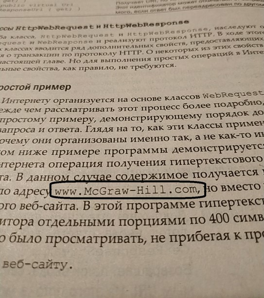
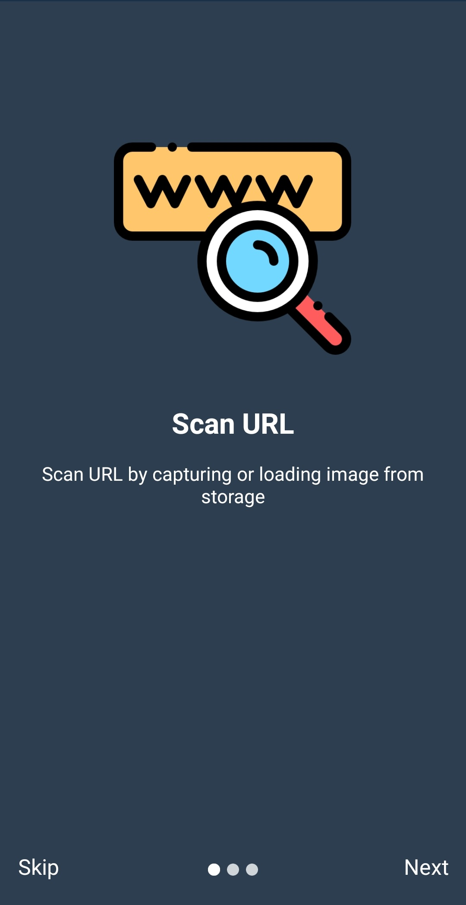
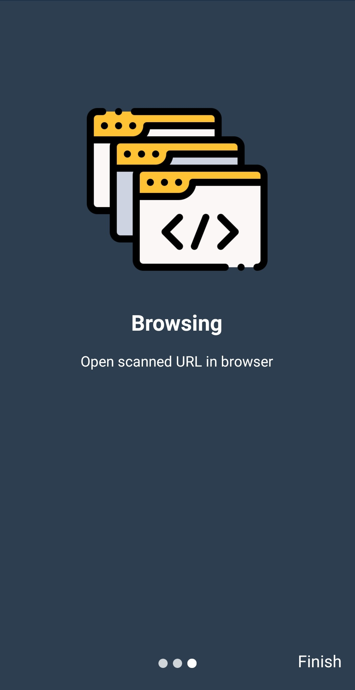
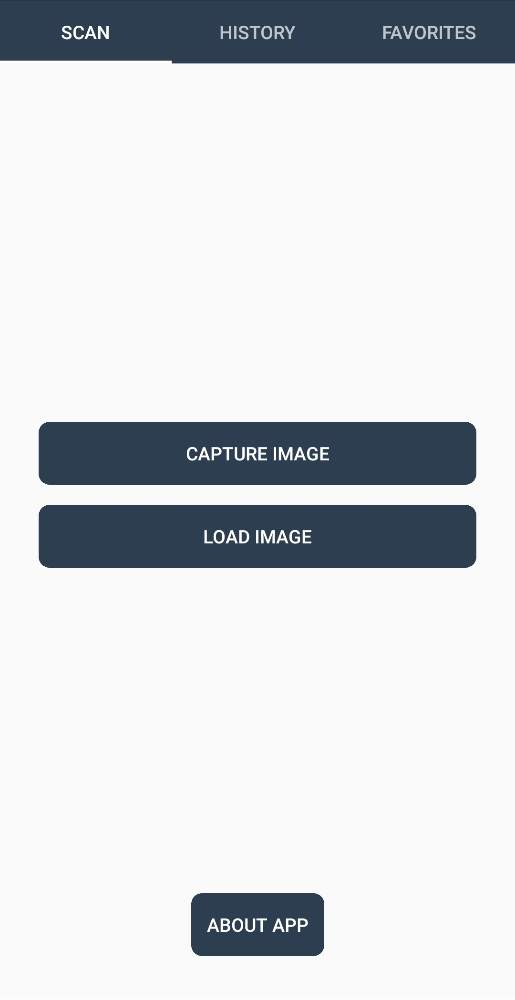
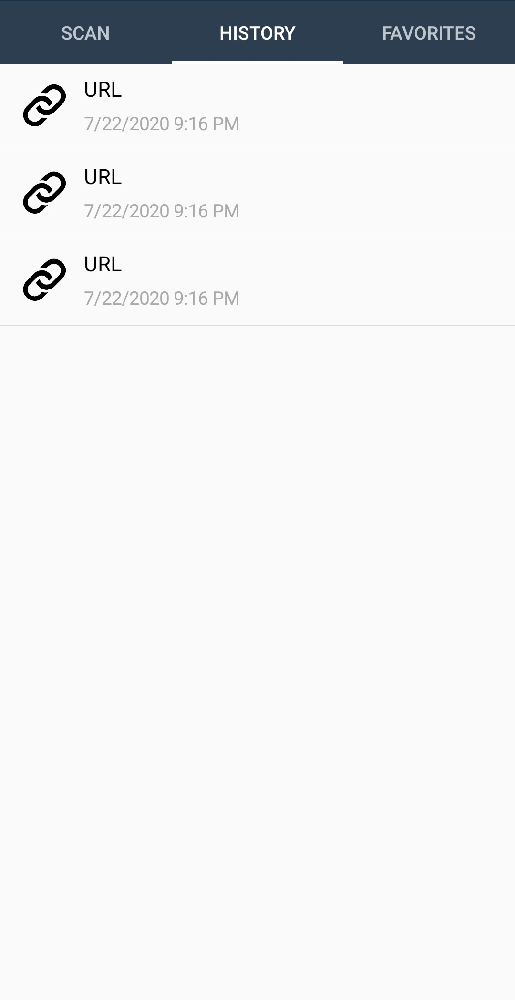
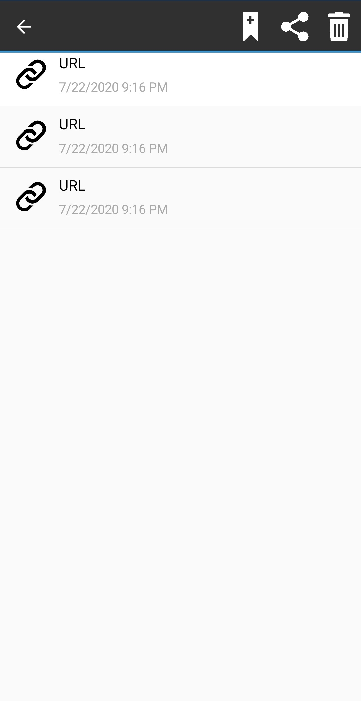
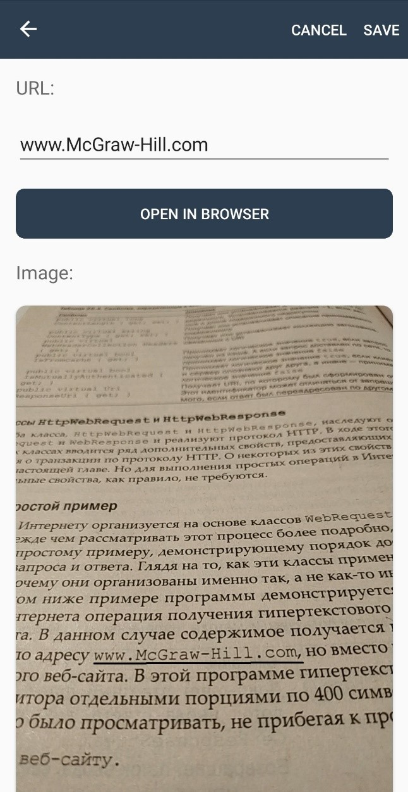
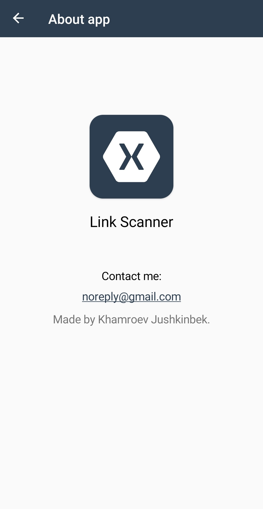

# LinkScanner

**Link Scanner - program for extracting an URL from image.**

Take a photo which contains an URL to extract it from the photo as a text. After you can follow this URL.

  
|  |
| :---: |

## Introduction Pages

<table>
<thead>
  <tr>
    <th colspan="3">Hello</th>
  </tr>
<tbody>
    <tr>
        <td></td>
        <td></td>
        <td></td>
    </tr>
</tbody>
</table>

## Main Pages

<table>
<tbody>
    <tr>
        <td></td>
        <td></td>
        <td></td>
    </tr>
</tbody>
</table>

## Detail Page

<table>
<tbody>
    <tr>
        <td></td>
        <td></td>
    </tr>
</tbody>
</table>

